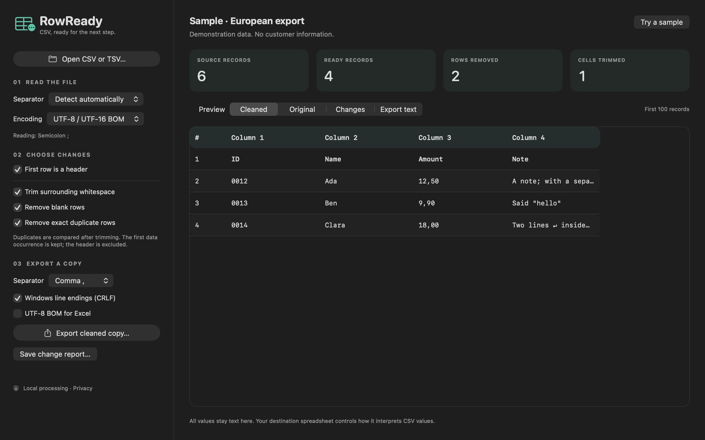

# RowReady CSV support

RowReady CSV is a native Mac utility for previewing CSV files and exporting cleaned copies. Version 1.0.0 has been submitted to Apple for review and is not yet available to purchase on the Mac App Store.

This repository is the public support channel maintained by Vali Mikayilov. It contains support material, not the app's source code.

The example uses fictional records. You can review the original data, cleaned data and change list before saving a separate copy.

## Get help

[Open a support request](https://github.com/valimikayilov/rowready-support/issues/new?template=support.yml) or [browse existing reports](https://github.com/valimikayilov/rowready-support/issues).

Include your macOS version, app version, the steps you took, what you expected and what happened. Use made-up data to demonstrate a problem. Issues and attachments are public: do not include confidential CSV files, passwords, banking details or personal information. A change report includes the source filename and fingerprint; review it before sharing.

## Working with files

- Open a CSV, TSV, semicolon-separated or pipe-separated file.
- Review the detected separator and encoding. Override them if needed.
- Choose whether the first record is a header.
- Turn on only the cleanup options you need: trim whitespace, remove blank records or remove exact duplicate data records.
- Review Original, Cleaned, Changes and Export text before saving a separate copy.

All cleanup options are off by default. Values remain strings; the app does not convert dates, numbers or formulas. Your destination spreadsheet may interpret them differently.

Version 1.0 requires macOS 14 or later. Limits: 20 MB, 250,000 records and 1,000 columns. The table preview shows up to 100 records and 30 columns; this preview limit does not truncate the export. Malformed quoting is rejected. Records with different numbers of columns are flagged and preserved.

## Privacy

Read the complete [RowReady CSV privacy policy](PRIVACY.md).

The app processes selected files on your Mac and has no network feature, analytics, advertisements or account system. It writes an output only when you export. The optional JSON report contains metadata and record numbers, not cell values. You control where exports are saved; synchronized folders can upload them under the storage provider's rules.

Public support issues are hosted by GitHub and are separate from the app. GitHub processes your interactions under its own privacy statement.
